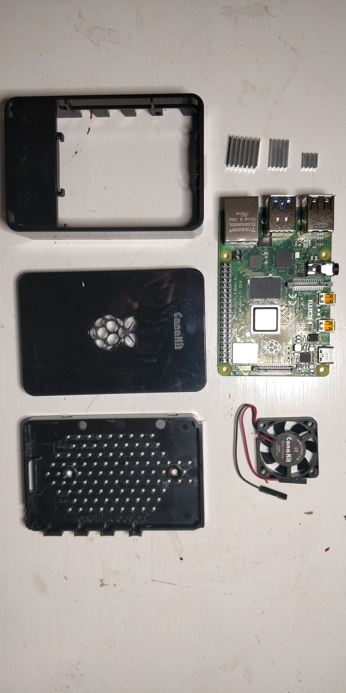
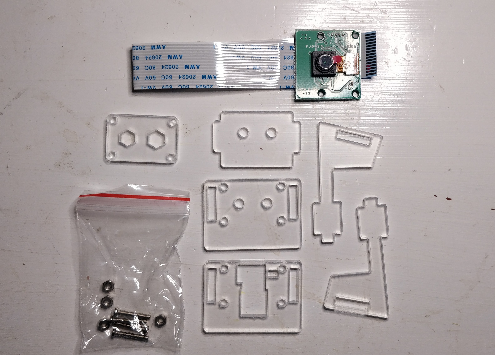
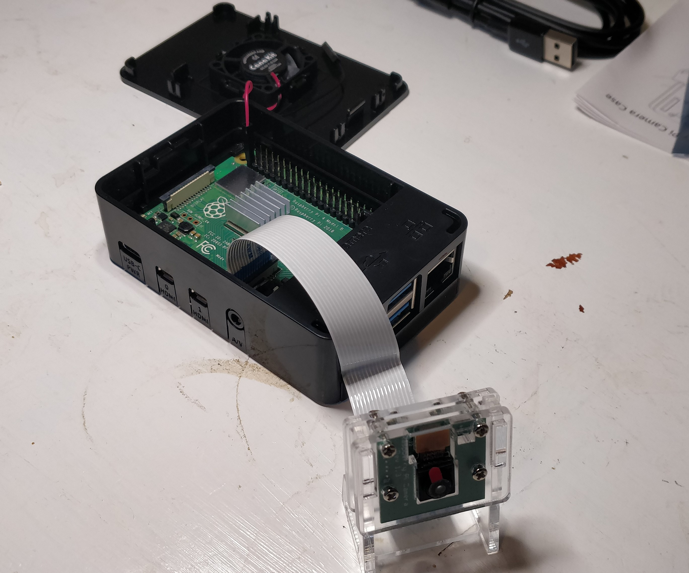
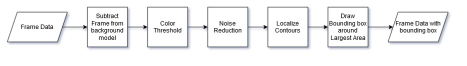
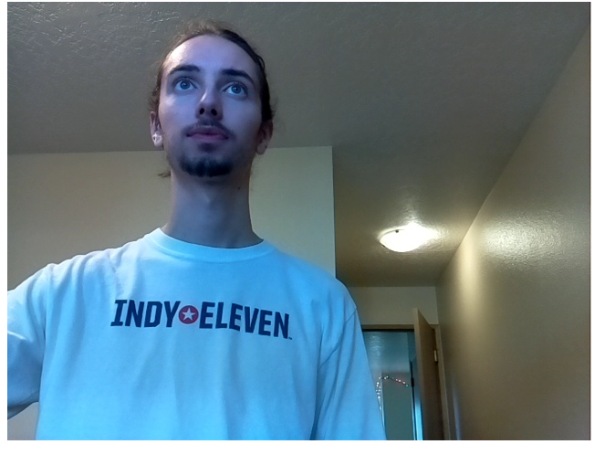
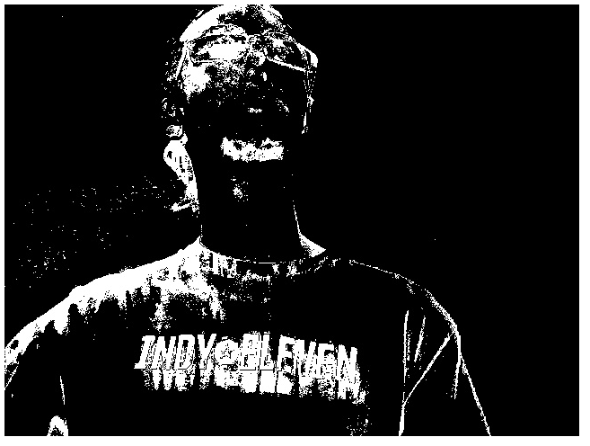
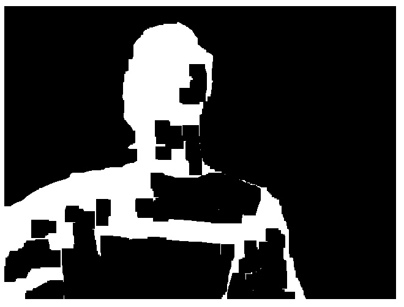
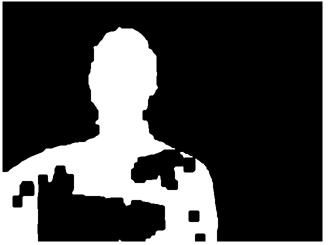
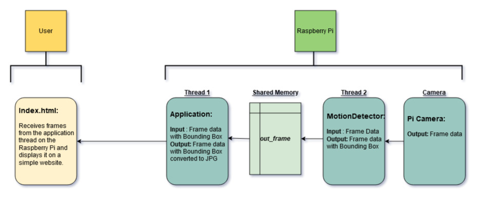

# TestObstacleDetection: Introduction
This project initially started as a proof of concept for navigation of robot using a Raspberry Pi to recieve a video from the Pi camera and detect motion. By the end of it I learned how to detect motion using OpenCV's subtraction algorithms and how to stream the results to a web browser using the micro-framework, Flask.

# Hardware Overview
For this project I used a Raspberry Pi 4 4GB along with the 5MP Pi camera V1 to capture and process images. The raspberry Pi was responsible for both processing the images, as well as sending them out to a locally hosted website, using Flask. Images of the hardware set up are shown below: 

# Software Overview and Methodology

## Motion Detection
The basic idea for my implementation of motion detection can be seen in the UML chart below, and in more depth in this article by OpenCV, [link](https://opencv-python-tutroals.readthedocs.io/en/latest/py_tutorials/py_video/py_bg_subtraction/py_bg_subtraction.html#):

Below I have added a specific example of the motion detection algorithms ran on a image of me standing in front of the camera. The first step takes the frame and subtracts it from the background model and turns it into a binary image for easier image processing. I then perform some noise reduction and smoothing using more of OpenCV's tools to remove sharp edges and salt and pepper noise. The final result is a relative singular white object representing the moving object. The software then will draw a bounding box to contain all the white pixels in the image. 

|Original Frame|Subtracted From Background Model|
|--|--|
 |  |
|Closing of Gaps|Smoothing of contours|
 |  

## Streaming to Website
OpenCV's subtraction algorithms provided a simple yet robust method of detecting motion from a static camera. Within my project I modulized this motion detection to the class `MotionDetector`. A thread then runs on the raspberry pi as a daemon and processes the incoming images and detects areas of motion using this class. This design choice allowed for multiple users to connect to the Flask application, but to have only one thread running the processor heavy motion detection algorithms. A UML diagram is provided below to help illustrate this idea:

The streaming was accomplished by the micro-fraemwork Flask which allowed for a very light weight and simple way to stream video over a local network. This allowed for easier remote development and proved that if in the future the Raspberry Pi was embedded in a chassis I could still have access to the computers vision. 

# Resources

[1] Morphological Transformations: https://docs.opencv.org/master/d9/d61/tutorial_py_morphological_ops.html

[2] Smoothing Images: https://docs.opencv.org/3.4/dc/dd3/tutorial_gausian_median_blur_bilateral_filter.html

[3] Images Thresholding: https://docs.opencv.org/master/d7/d4d/tutorial_py_thresholding.html

[4] Finding Contours: https://docs.opencv.org/master/d4/d73/tutorial_py_contours_begin.html

[5] Article on Motion Detection on Rapberry Pi: https://docs.opencv.org/master/d4/d73/tutorial_py_contours_begin.html

[6] Tutorial on downloading OpenCV on Rapberry Pi: https://www.pyimagesearch.com/2019/09/16/install-opencv-4-on-raspberry-pi-4-and-raspbian-buster/

[7] Example of streaming video from Raspberry Pi: https://www.pyimagesearch.com/2019/09/16/install-opencv-4-on-raspberry-pi-4-and-raspbian-buster/

